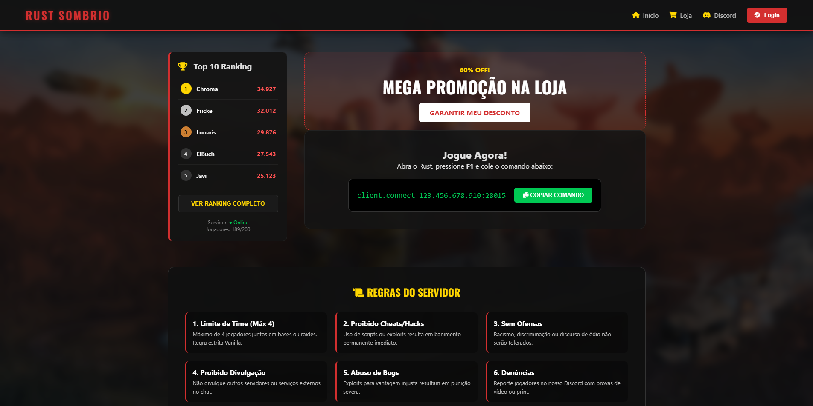

# ☢️ Rust Sombrio - Server UI

Este é o **front-end** de uma landing page para um servidor do jogo Rust. O projeto foi desenvolvido com foco em UI/UX sombria e imersiva, utilizando tecnologias modernas de CSS para garantir um layout simétrico e responsivo.

## 🚀 Tecnologias Utilizadas
* **HTML5**: Estruturação semântica.
* **CSS3**: Layouts com Flexbox e Grid, efeitos de Glassmorphism e variáveis (CSS Variables).
* **Fontes**: Oswald (Google Fonts) para títulos e Roboto para leitura.

## 🎨 Destaques do Projeto
- **Alinhamento Preciso**: Sidebar de ranking e blocos de conteúdo sincronizados com o grid de regras.
- **Identidade Visual**: Cores baseadas na temática de sobrevivência (Rust) com tons de vermelho escuro, amarelo ouro e verde sucesso.
- **Efeitos de Vidro**: Uso de `backdrop-filter` para criar profundidade sobre o background.

## 📅 RoadMap (Próximas Atualizações)
Este projeto é um portfólio em constante evolução. As próximas etapas incluem:
- [ ] Integração com a **API da Steam** para login real.
- [ ] Sistema de **Ranking Dinâmico** (Fetch do Banco de Dados).
- [ ] Checkout automatizado para a loja VIP.

## 📸 Preview

---
Desenvolvido por **Erick Fricke** | Focado em transformar design em código limpo.